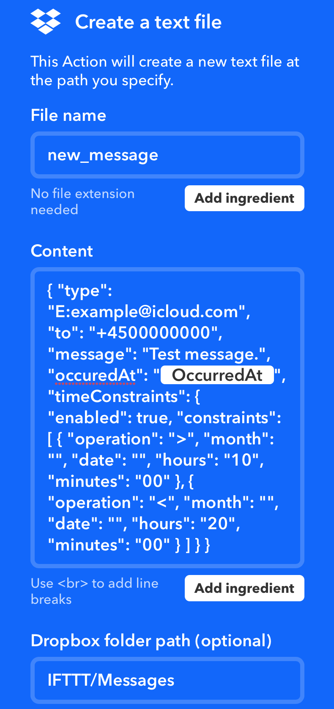

# Send Message

Automatically send an iMessage or SMS from your iPhone to whomeveer you like when something happens, like: 
- You arrive at a certain location.
- Your smart alarm system turns on.
- Well pretty much any event you can catch on IFTTT, Zapier or the likes there of.


## Requirements
To pull this one off, you need a few things:
- An iPhone.
- A Mac that is always on.
- A IFTTT account.
- A Dropbox account.
- `./scripts/send-message/send-message.workflow`


## Setup Instructions
1) Setup your iPhone to send iMessges and SMS.
2) Setup Messages App on your Mac, so you can send iMessages and SMS from the Mac.
3) Install Dropbox on the Mac.  
  3.a) Create a fonder in Dropbox ex. `./IFTTT/Messages/`
4) Install IFTTT on your iPhone.
5) Double Click the file `./scripts/send-message/send-message.workflow` and on the prompth, chose the folder we created in Dropbox.
6) Create an IFTTT [Button Widget](https://ifttt.com/do_button) that creates a file in the Dropbox folder we created.   
  6.a) See example file (new_message.txt) below.  
7) Push the IFTTT button from the widget screen on your iPhone. 
8) If the message is sent as expected you are DONE.  
  9.a) If not, you may need to give Automator permission to access the file system and Messages.  
  9.b) Open `./scripts/send-message/send-message.workflow` in Automator.  
  9.c) Enable "Testing with specefied input" at the top.  
  9.d) Manualy create a file contaning the JSON from above and select it in Automator.  
  9.e) Push the Play button in automator and grant it access. 

That's it!


### Example: new_message.txt
```JSON
{
  "type": "E:example@icloud.com",
  "to": "+4500000000",
  "message": "Test message.",
  "occuredAt": "{{OccurredAt}}",
  "timeConstraints": {
      "enabled": true,
      "constraints": [
          {
              "operation": ">",
              "month": "",
              "date": "",
              "hours": "10",
              "minutes": "00"
          },
          {
              "operation": "<",
              "month": "",
              "date": "",
              "hours": "20",
              "minutes": "00"
          }
      ]
  }
}
```
  
**Example explained**
```JSON5
{
  "type": "SMS",                   // Can either be an iMessage account or 'SMS'
  "to": "+4500000000",             // The phone number of the recipient of the message.
  "message": "Test message.",      // The message you wish to send.
  "occuredAt": "{{OccurredAt}}",   // DON'T touch this, it lets IFTTT tell our script when IFTTT was triggered.
  "timeConstraints": {             // Lets you specefy when a trigger should result in sending a message. 
      "enabled": true,             // Enable or Disable 'timeConstraints'.
      "constraints": [             // A list of constraints for when messages are sent.
          {
              "operation": ">",    // DateTime is greatert than (< > =).
              "month": "",         // The month of the year (1-12).
              "date": "",          // The date of the month (1-31).
              "hours": "10",       // The hours of the day (0-23).
              "minutes": "00"      // The minutes of the hour (0-59).
          }
          ,                        // AND
          {
              "operation": "<",    // DateTime is less then (< > =).
              "month": "",         // The month of the year (1-12).
              "date": "",          // The date of the month (1-31).
              "hours": "20",       // The hours of the day (0-23).
              "minutes": "00"      // The minutes of the hour (0-59).
          }
      ]
  }
}
```

This example would an SMS, from "your iPhone", to: "+4500000000", with the message: "Test message." But only between 10AM and 8PM.

**IFTT Dropbox file**  

